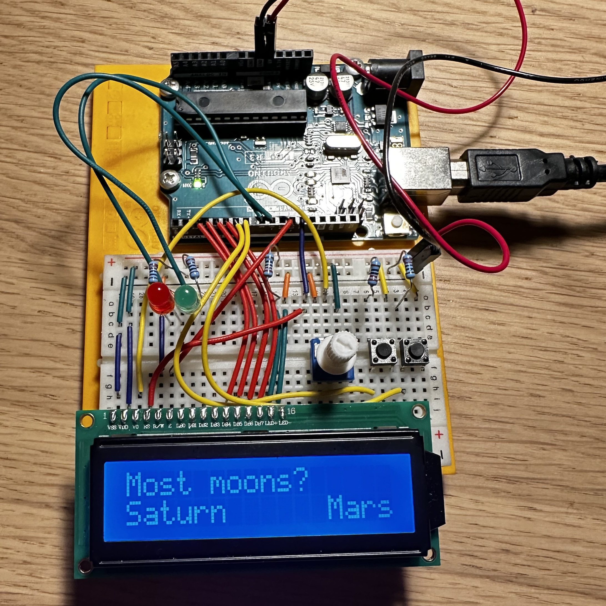
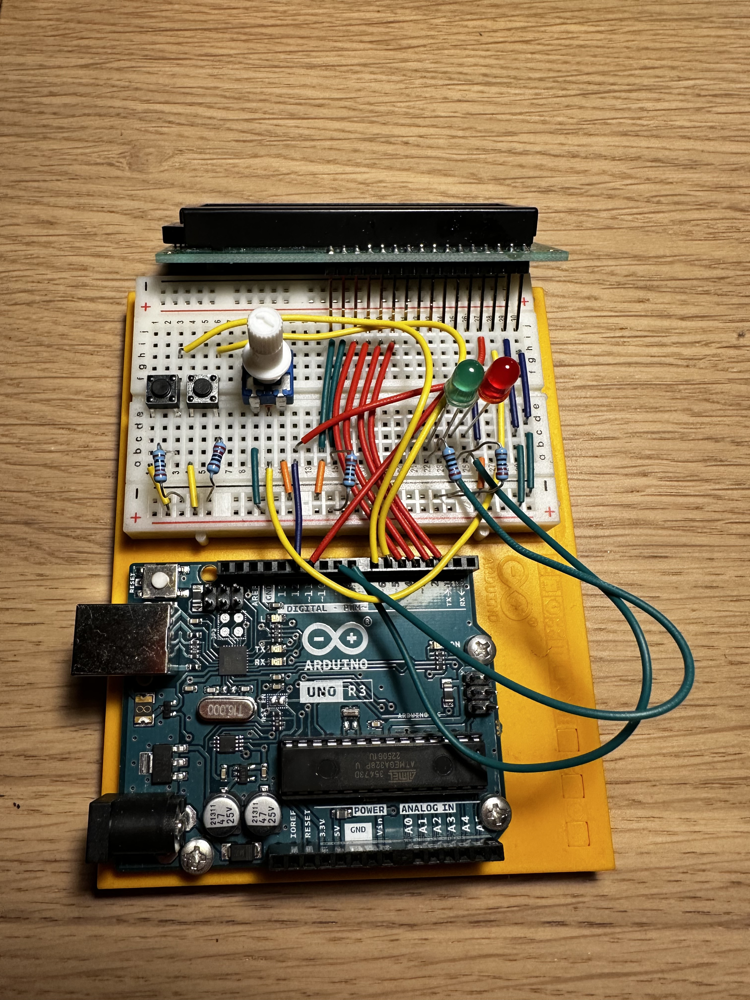
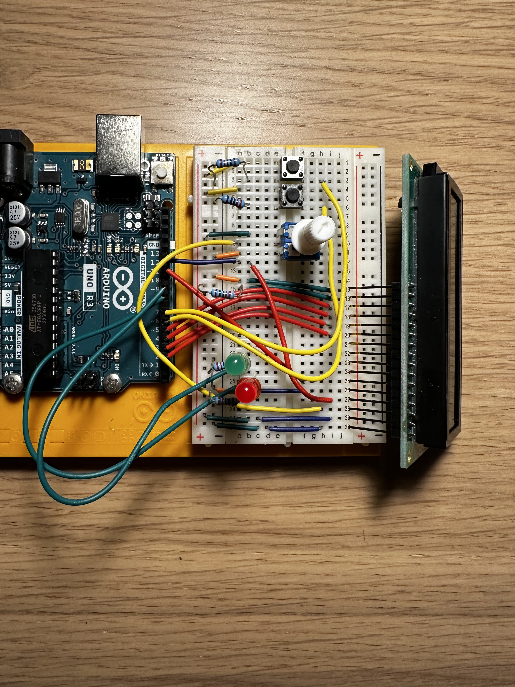

# Quiz Machine

A very simple quiz machine. It can prompt questions with two options for answers. A red light will light if it´s the wrong answer, otherwise the green light will indicate correct answer. At the end, the point score will be seen. Can be resetted by holding down the two buttons.

It´s inspired by the Arduino book, and is a modified version of the project in Chapter 11: "Crystal Ball". This project uses a lot of that chapter´s schematics for connecting to the LED screen and potentionmeter.

I won´t be uploading the schematics as of now, but you can check out Chapter 11 of the Arduino book for connecting to LED.

## Specifications

This project uses the `LiquidCrystal` library that is shipped with the Arduino IDE.

- LED: TC1602A-21T(R)(3)
- The resistors in this circuit are 220 ohms

## Circuitry photos

The LED screen is disconnected for easier overview, but it´s pins are right above their respecitve slots.

